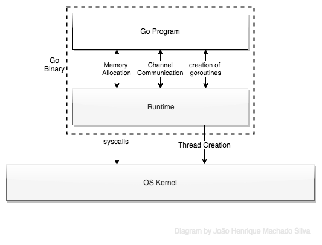

# goroutine

### goroutine是什么？
goroutine 依赖于线程运行
### 什么是线程？ 
线程是执行的最小单元  一个进程可以存在多个线程 线程与线程之间是共享内存的 创建新的线程时 不用创建新的虚拟空间 线程之间可以通过共享内存进行通信 而进程则需要各种模式的IPC(进程间通信),如信号,消息队列,管道.
linux 调用fork 创建线程
Linux开发人员已经尝试将任务切换之间的成本降至最低，并且已经取得了成功。创建新进程仍然比新线程更大的开销，但切换不是 

### 三种情况使线程变慢
1、线程堆栈大小>=1MB 占用太多内存 创建越多的线程 就占用越多的内存
2、 线程需要恢复许多寄存器，其中一些包括AVX（高级向量扩展），SSE（流式SIMD外设），浮点寄存器，程序计数器（PC），堆栈指针（SP），这会损害应用程序性能。
3、线程设置和拆卸需要调用操作系统以获取缓慢的资源

goroutine 实现原理
gorotine是存在于Go运行时的虚拟空间中 而不存在与OS内核变量中， 因此需要调用 GoRuntime 来管理goroutine 的声明周期 
goroutine本身由Go Runtime Scheduler管理

https://golang.org/src/runtime/runtime2.go
Golang 为此维护了三个结构
1、 G Struct  ：表示单个goroutine，包含跟踪其堆栈和当前状态所需的字段。它还包含对其负责的代码的引用。
2、M Struct  ：表示OS线程。它还包含指向字段的指针，例如runnable goroutines的全局队列，当前运行的goroutine，它自己的缓存以及对调度程序的引用
3、Sched Struct  ：它是一个单一的全局结构，用于跟踪goroutine和M的不同队列以及调度程序运行时需要的其他一些信息，例如Global Sched Lock。

因此，在启动时，运行时会为GC，调度程序和用户代码启动许多goroutine。创建OS线程来处理这些goroutine。这些线程最多可以等于GOMAXPROCS（默认为1，但为了获得最佳性能，通常设置为计算机上的处理器数量）

为了使堆栈变小，Go的运行时使用可调整大小的有限堆栈，最初只有2KB / goroutine。一个新的goroutine给了几千字节，这几乎总是足够的。如果不是，运行时会自动增长（并缩小）内存以自动存储堆栈，从而允许许多goroutine存在于适量的内存中。CPU开销平均每个函数调用大约三个便宜的指令。在同一地址空间中创建数十万个goroutine是切实可行的。如果goroutines只是线程，系统资源将以更小的数量运行。

当goroutine进行阻塞调用时，例如通过调用阻塞系统调用，运行的线程必须阻塞，运行时自动将同一操作系统线程上的其他goroutine移动到从队列中取出的另一个可运行的线程。调度程序（Sched Struct）因此不会被阻止。因此，运行时应至少创建一个线程，以继续执行不在阻塞调用中的其他goroutine。程序员没有看到这一点，这就是重点。结果，我们称之为goroutines，可以非常便宜：它们在堆栈的内存之外几乎没有开销，这只是几千字节。

Russ Cox解释说GOMAXPROCS就像一个多路复用器，所以GOMAXPROCS就会是一个瓶颈。
参考
goroutine如何运行 
https://medium.com/@joaoh82/what-are-goroutines-and-how-do-they-actually-work-f2a734f6f991
GOMAXPROCS
https://colobu.com/2017/10/11/interesting-things-about-GOMAXPROCS/